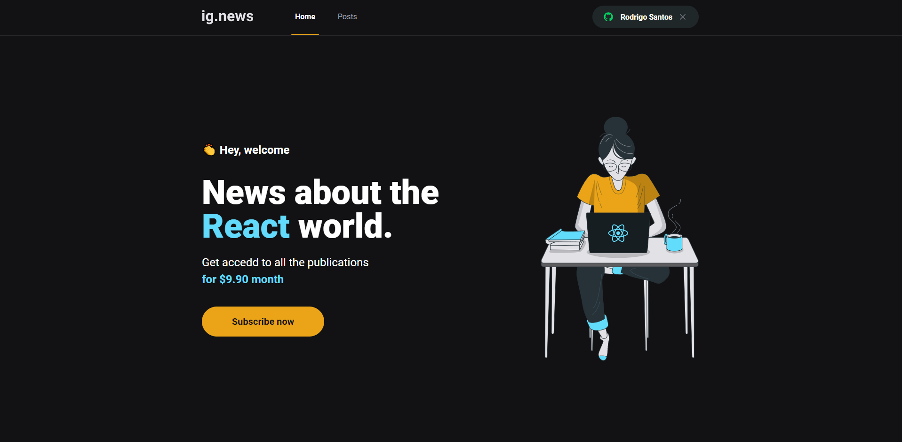
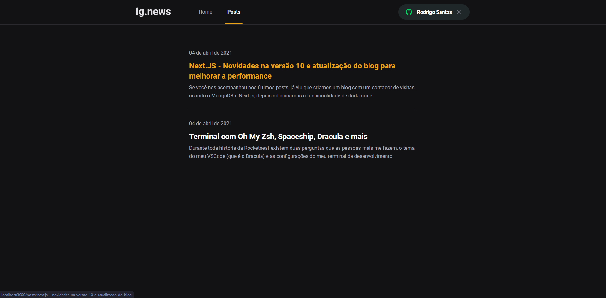
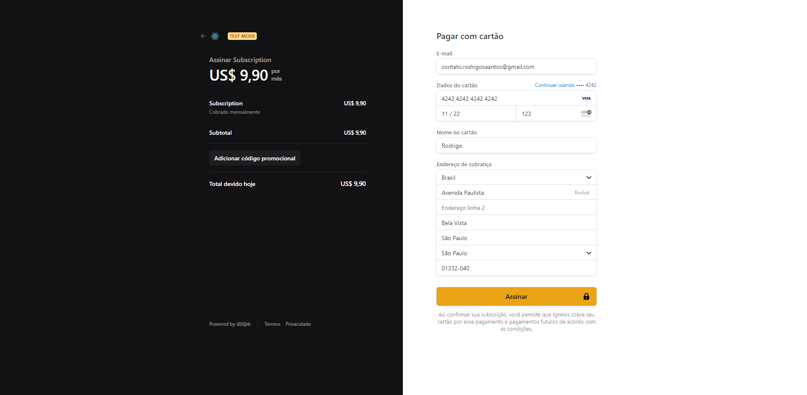
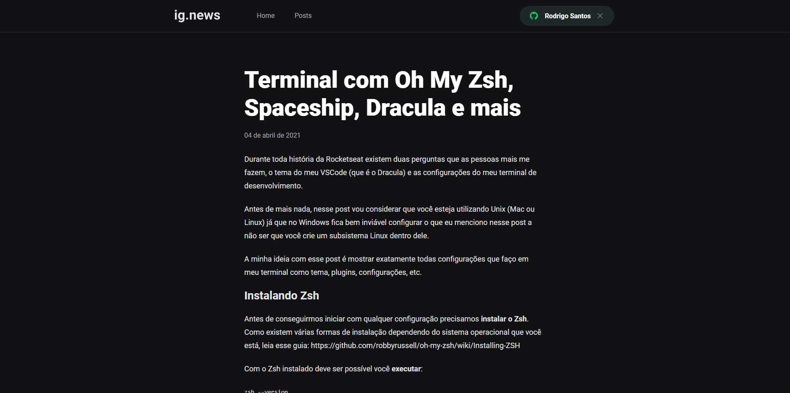
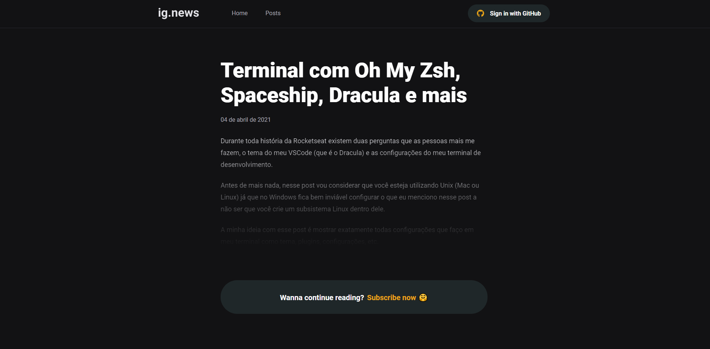
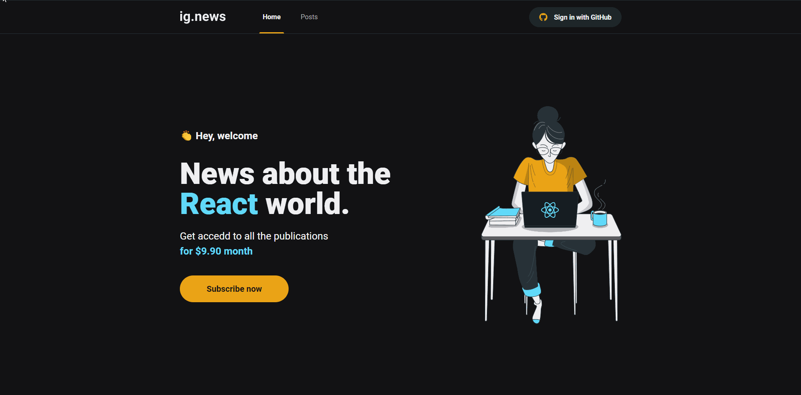

<h2 align="center">
  <div>
    
  <div>

  
</h2>

<h1 align="center">
    Ig.news | Ignite
</h1>

<div align="center">

  <a href="">
    
  </a>

  <a href="">
    
  </a>

  <a href="">
    
  </a>

  <a href="">
    
  </a>

</div>

<p align="center"> Application developed in the Rocketseat Ignite 💻🚀 </p>

<p align="center">
 <a href="#about">About</a> •
 <a href="#technologies">Technologies</a> •
 <a href="#usage">Usage</a> •
 <a href="#contribution">Contribution</a> •
 <a href="#author">Author</a> •
 <a href="#demo">Demo</a> •
 <a href="#license">License</a>
</p>

<h1 align="center">
    
  <div style="display: flex; flex-direction: row;">
    
    
  <div>
  <div style="display: flex; flex-direction: row;">
    
    
  <div>
</h1>

<h4 align="center">
	 📝 Ig.news | Ignite ⏰📈 Loading...  📝
</h4>

<h2 id="about" > 🎯 About </h2>

Application developed in the o chapter III from bootcamp Ignite - @Rocketseat. Ig.news is application that provides paid content.

<h2 id="technologies"> 🛠 Technologies </h2>

The following tools were used in the construction of the project:

- [ReactJS](https://reactjs.org)
- [NextJS](https://nextjs.org)
- [NodeJS](https://nodejs.org/en/)
- [Yarn](https://yarnpkg.com) or Npm
- [VSCode](https://code.visualstudio.com)
- [Git Bash](https://gitforwindows.org/)
- [FaunaDB](https://fauna.com/)
- [Prismic](https://prismic.io/)
- [SASS](https://sass-lang.com/)
- [Stripe](https://stripe.com/en-br/)

<h2 id="usage" > 👷 Usage </h2>

Rename file ``".env.local.example"`` to ``".env.local"``, then change the values

Required! Install git, node and yarn (or npm).

```bash
# Clone Repository
$ git clone https://github.com/RodrigoSaantos/ignews.git

# Go to server folder
$ cd ignews

# Install Dependencies
$ yarn
# or
$ npm install

# Run Aplication
$ yarn dev
# or
$ npm run dev

# Access localhost
http://localhost:3000
```

<h2 id="contribution"> 🤝 Contribution </h2>

This project is for study purposes too. All kinds of contributions are very welcome and appreciated!

- Fork this repository;
- Create a branch with your feature: `git checkout -b my-feature`;
- Commit your changes: `git commit -m 'feat: My new feature'`;
- Push to your branch: `git push origin my-feature`.

<h2 id="author"> 💻 Author </h2>


By Rodrigo Santos 👋🏽 Find me:

[](https://www.linkedin.com/in/rodrigo-dos-santos-silva-637225156/)
|
[](mailto:contato.rodrigosaantos@gmail.com)

<h2 id="demo"> 🎌 Demo </h2>

<h1 align="center">
  <div style="display: flex; flex-direction: row;">
    
    
  <div>
</h1>

<h2 id="license"> 📝 License </h2>

This project is under the MIT license.
